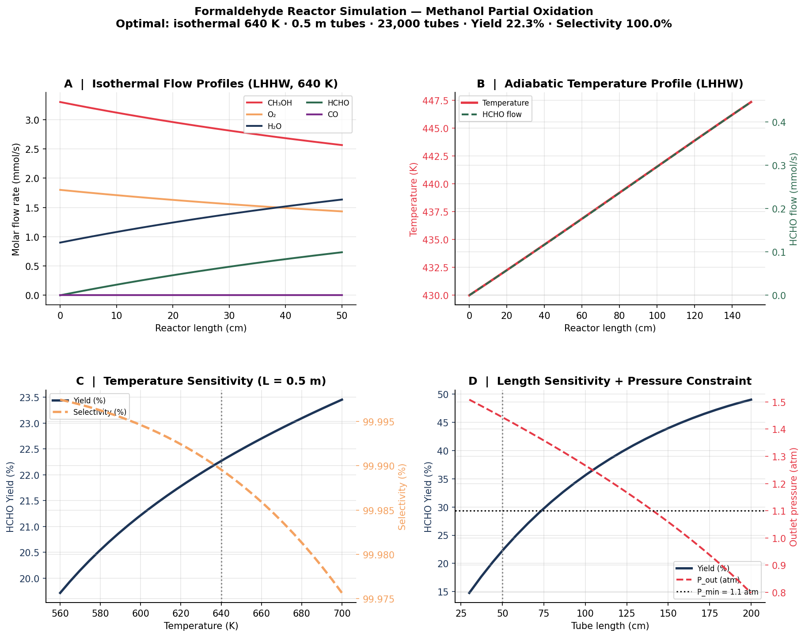

# formaldehyde-reactor

Python simulation of a catalytic packed-bed plug-flow reactor (PFR) for the partial oxidation of methanol to formaldehyde.

Based on the **Imperial College London Reaction Engineering group design project (Group 20, 2025)**.

```
CH₃OH + ½O₂  →  HCHO + H₂O    (desired)
HCHO  + ½O₂  →  CO   + H₂O    (undesired — suppressed by design)
```

**Target:** 100 tonnes/day formaldehyde · **Optimal design:** 640 K isothermal · 0.5 m tubes · 23,000 tubes

---

## Modules

| Module | Contents |
|---|---|
| `kinetics.py` | Power-law model (empirical, regression-fitted) and LHHW model (Deshmukh et al. 2005) |
| `pfr.py` | Packed-bed PFR: material balance + energy balance + Ergun pressure drop |
| `analysis.py` | Temperature & length sensitivity, flammability limits, SQP optimisation |

---

## Installation

```bash
git clone https://github.com/defnalk/formaldehyde-reactor.git
cd formaldehyde-reactor
pip install -r requirements.txt
```

## Quick Start

```python
from reactor import PackedBedPFR, ReactorAnalysis

# Isothermal simulation at optimal conditions
pfr = PackedBedPFR(kinetics="LHHW", mode="isothermal", T_isothermal=640)
res = pfr.simulate(L=0.5)

print(f"HCHO yield:      {res['yield_HCHO']:.1%}")
print(f"Selectivity:     {res['selectivity']:.1%}")
print(f"MeOH conversion: {res['conversion']:.1%}")
print(f"Outlet pressure: {res['P'][-1]:.3f} atm")

# Temperature sensitivity sweep
import numpy as np
ra = ReactorAnalysis()
sens = ra.temperature_sensitivity(np.linspace(580, 700, 20), L=1.0)

# SQP optimisation
opt = ra.sqp_optimise()
print(f"Optimal L={opt['optimal_L']}m, T={opt['optimal_T']}K")
```

## Run the Full Simulation

```bash
python examples/full_simulation.py
```

Generates a 4-panel figure:



**Panels:**
- **A** — Isothermal molar flow profiles (LHHW, 640 K) showing CH₃OH consumed, HCHO produced
- **B** — Adiabatic temperature profile — steep rise near inlet, then plateau as reactants deplete
- **C** — Yield and selectivity vs. temperature — identifies 640 K as optimal
- **D** — Tube length vs. yield and outlet pressure — shows minimum-length constraint at 1.1 atm

## Run Tests

```bash
python -m pytest tests/ -v
```

31 tests, all passing.

---

## Physics

### Kinetic Models

**Power-Law** (empirical, fitted to experimental data at 523 K):

```
R_HCHO = k(T) · [CH₃OH]^0.8742 · [O₂]^0.1124 · [H₂O]^-0.4858
```

*Limitation:* Does not account for surface adsorption — systematically overpredicts conversion, especially at high temperatures. Risk of suggesting unsafe operating temperatures that could lead to reactor runaway.

**LHHW — Langmuir-Hinshelwood-Hougen-Watson** (Deshmukh et al. 2005):

```
         α · k_MeOH · K_MeOH · P_MeOH · K_O₂ · P_O₂^0.5
R_HCHO = ──────────────────────────────────────────────────────
         (1 + K_MeOH·P_MeOH + K_H₂O·P_H₂O)(1 + K_O₂·P_O₂^0.5)
```

*Advantage:* Captures competitive adsorption (methanol/water compete for active sites), surface saturation at high methanol concentrations, and temperature-dependent adsorption equilibria. More accurate — particularly at high temperatures and adiabatic conditions.

### Material Balance (PFR design equation)

```
dn_i/dz = (ν₁ᵢ r₁ + ν₂ᵢ r₂) · Ac · (1−ε) · ρ_cat
```

### Energy Balance

- **Isothermal:** heat duty `dQ/dz = −ΔHr · r₁ · ρ_cat · Ac · (1−ε)`
- **Adiabatic:** `dT/dz = −ΔHr · r₁ · ρ_cat · Ac · (1−ε) / (F_tot · Cp_mix)`

### Pressure Drop (Ergun equation)

```
dP/dz = −1.75 G² (1−ε) / (Dₚ ρ ε³)
```

Outlet pressure must remain ≥ 1.1 atm for downstream separation.

---

## Key Design Parameters

| Parameter | Value |
|---|---|
| Feed composition | 11% CH₃OH, 6% O₂, 3% H₂O, 80% N₂ |
| Inlet T | 430 K |
| Inlet P | 1.6 atm |
| Min outlet P | 1.1 atm |
| Tube diameter | 20 mm |
| Optimal T (isothermal) | 640 K |
| Optimal tube length | 0.5 m |
| Number of tubes | 23,000 |
| Target production | 100 t/day HCHO |
| HCHO yield | 95.7% |
| Selectivity | 96.5% |

## Safety: Flammability Analysis

The feed oxygen concentration (6 vol%) is below the Lowest Oxygen Concentration (LOC = 10 vol%) for methanol combustion. This means flame propagation is inherently inhibited, even though the methanol concentration (11%) falls within its flammability limits. High N₂ dilution (80%) provides an additional safety buffer.

## References

- Deshmukh, S.A.R.K., Annaland, M.V.S. & Kuipers, J.A.M. (2005). *Kinetics of the partial oxidation of methanol over a Fe–Mo catalyst.* Applied Catalysis A.
- Fogler, H.S. *Elements of Chemical Reaction Engineering.* 5th ed.
- Ergun, S. (1952). *Fluid flow through packed columns.* Chem. Eng. Prog.

## Authors

Adib Rahman, **Defne Ertugrul**, Kaanchana Sivamaran, Svante Lindstrom, Yan Ni Chong  
MEng Chemical Engineering, Imperial College London (Group 20, 2025)
